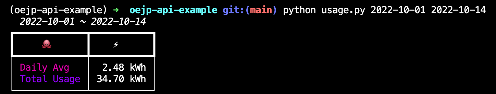

# Octopus Energy Japan API example project

A few examples using the Octopus Energy API

## Local setup

Create a virtual environment and install dependencies:
```bash
python -m venv env
pip install -r requirements.txt
```

Add a .env file to your project root like so:
```bash
API_URL=https://api.oejp-kraken.energy/v1/graphql/  # or a different URL if you're not with Octopus Energy Japan
OCTOPUS_EMAIL=<YOUR EMAIL>
OCTOPUS_PASSWORD=<YOUR PASSWORD>
```

## Run a local API with [FastAPI](https://fastapi.tiangolo.com/)

```bash
uvicorn main:app --reload
```

You should be able to use the browsable FastAPI to try the API out at [http://localhost:8000/docs](http://localhost:8000/docs).


## Print energy usage with [rich](https://github.com/Textualize/rich)

Calculate basic statistics about your electricity usage. The output is saved as an _svg_.

```bash
python usage.py 2022-10-01 2022-10-14
```


